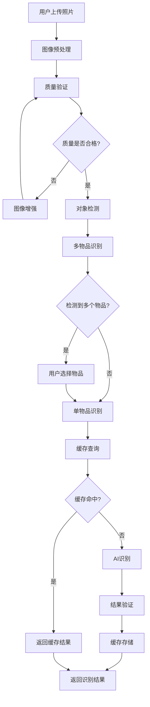
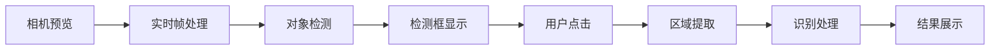
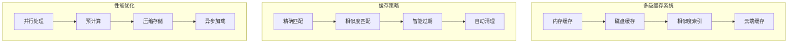

# 架构设计文档

## 概述

LuggageHelper 采用现代 iOS 开发架构，结合 MVVM 模式、SwiftUI 和先进的 AI 集成技术，构建了一个高性能、可扩展的智能行李管理应用。

## 整体架构

### 架构图

```
┌─────────────────────────────────────────────────────────────┐
│                    LuggageHelper App                        │
├─────────────────────────────────────────────────────────────┤
│                   Presentation Layer                        │
│  ┌─────────────┐  ┌─────────────┐  ┌─────────────┐         │
│  │   SwiftUI   │  │  ViewModels │  │ Components  │         │
│  │    Views    │◄─┤   (MVVM)    │  │   Library   │         │
│  └─────────────┘  └─────────────┘  └─────────────┘         │
├─────────────────────────────────────────────────────────────┤
│                    Business Layer                           │
│  ┌─────────────┐  ┌─────────────┐  ┌─────────────┐         │
│  │ AI Services │  │   Core      │  │   Utils &   │         │
│  │   System    │  │  Services   │  │  Extensions │         │
│  └─────────────┘  └─────────────┘  └─────────────┘         │
├─────────────────────────────────────────────────────────────┤
│                     Data Layer                              │
│  ┌─────────────┐  ┌─────────────┐  ┌─────────────┐         │
│  │   Models    │  │   Cache     │  │   Network   │         │
│  │   & DTOs    │  │   System    │  │   Layer     │         │
│  └─────────────┘  └─────────────┘  └─────────────┘         │
├─────────────────────────────────────────────────────────────┤
│                   Platform Layer                            │
│  ┌─────────────┐  ┌─────────────┐  ┌─────────────┐         │
│  │   Core      │  │   System    │  │  External   │         │
│  │   Data      │  │  Services   │  │   APIs      │         │
│  └─────────────┘  └─────────────┘  └─────────────┘         │
└─────────────────────────────────────────────────────────────┘
```

## 核心组件

### 1. Presentation Layer (表现层)

#### SwiftUI Views
- **ContentView**: 主界面 TabView 容器
- **LuggageListView**: 行李管理界面
- **ItemListView**: 物品管理界面
- **TravelChecklistView**: 清单管理界面
- **StatisticsView**: 统计分析界面
- **AdvancedFeaturesView**: AI 功能统一入口

#### 照片识别增强视图
- **AIPhotoIdentificationView**: 主要照片识别界面，支持拍照和相册选择
- **RealTimeCameraView**: 实时相机识别界面，支持实时物品检测
- **BatchRecognitionResultsView**: 批量识别结果展示
- **PhotoRecognitionErrorGuidanceView**: 错误处理和用户引导界面
- **OfflineModelManagementView**: 离线模型管理界面

#### ViewModels (MVVM)
- **LuggageViewModel**: 行李数据管理
- **AIViewModel**: AI 功能状态管理
- 遵循 ObservableObject 协议
- 使用 @Published 属性进行数据绑定

#### Components Library
- **ErrorDisplayView**: 错误信息展示组件
- **LoadingStateView**: 加载状态组件
- **NetworkStatusView**: 网络状态指示器
- **AIItemTagsView**: AI 标签展示组件

### 2. Business Layer (业务层)

#### AI Services System
```swift
// 核心 AI 服务架构
LLMAPIService (主服务)
├── LLMAPIService+AIFeatures (AI 功能扩展)
├── LLMAPIService+PackingFeatures (装箱功能)
├── LLMAPIService+Helpers (辅助方法)
├── LLMAPIService+DataSecurity (数据安全扩展)
└── AIRequestQueue (请求队列管理)

// 照片识别服务架构
PhotoRecognitionService (照片识别主服务)
├── ImagePreprocessor (图像预处理)
├── ObjectDetectionEngine (对象检测引擎)
├── BatchRecognitionService (批量识别服务)
├── OfflineRecognitionService (离线识别服务)
├── RealTimeCameraManager (实时相机管理)
└── PhotoRecognitionCacheManager (照片识别缓存)

// 图像处理和分析
ImageProcessingPipeline
├── ImageHasher (图像哈希计算)
├── ImageSimilarityMatcher (相似度匹配)
├── ImageMemoryManager (内存管理)
├── PhotoCacheStorage (缓存存储)
└── RecognitionResultValidator (结果验证)

// 用户体验增强服务
UserExperienceServices
├── PhotoRecognitionErrorRecoveryManager (错误恢复)
├── PhotoRecognitionQualityManager (质量管理)
├── UserFeedbackManager (用户反馈)
├── PersonalizedRecognitionOptimizer (个性化优化)
└── AccessibilityService (无障碍支持)

// 支持服务
AICacheManager (缓存管理)
PerformanceMonitor (性能监控)
AIItemCategoryManager (分类管理)
DataSecurityService (数据安全)
```

#### Core Services
- **ErrorHandlingService**: 统一错误处理
- **NetworkMonitor**: 网络状态监控
- **LoadingStateManager**: 加载状态管理
- **UndoRedoManager**: 撤销重做功能
- **ItemReplacementService**: 物品替代服务

### 3. Data Layer (数据层)

#### Models & DTOs
```swift
// 核心数据模型
struct Luggage: Identifiable, Codable
struct LuggageItem: Identifiable, Codable
struct TravelChecklist: Identifiable, Codable

// AI 相关模型
struct ItemInfo: Codable
struct PackingPlan: Codable
struct TravelSuggestion: Codable
struct AirlineLuggagePolicy: Codable

// 缓存模型
struct CacheEntry<T: Codable>: Codable
struct CacheStatistics
```

#### Cache System
- **分层缓存策略**: 内存缓存 + 磁盘缓存
- **智能过期机制**: 不同类型数据不同过期时间
- **压缩存储**: LZFSE 算法压缩缓存数据
- **自动清理**: 基于大小和时间的自动清理

#### Network Layer
- **HTTP 客户端**: URLSession 封装
- **请求管理**: 并发控制和重试机制
- **响应处理**: JSON 解析和错误处理
- **安全通信**: HTTPS 和证书验证

## 照片识别功能架构

### 照片识别处理流程



### 实时相机识别架构



### 缓存系统架构



## 设计模式

### 1. MVVM (Model-View-ViewModel)

```swift
// View
struct ItemListView: View {
    @StateObject private var viewModel = ItemViewModel()
    
    var body: some View {
        // UI 实现
    }
}

// ViewModel
@MainActor
class ItemViewModel: ObservableObject {
    @Published var items: [LuggageItem] = []
    @Published var isLoading = false
    
    private let service = ItemService()
    
    func loadItems() async {
        // 业务逻辑
    }
}

// Model
struct LuggageItem: Identifiable, Codable {
    let id: UUID
    var name: String
    var weight: Double
    // 其他属性
}
```

### 2. Repository Pattern

```swift
protocol ItemRepository {
    func fetchItems() async throws -> [LuggageItem]
    func saveItem(_ item: LuggageItem) async throws
    func deleteItem(id: UUID) async throws
}

class CoreDataItemRepository: ItemRepository {
    // Core Data 实现
}

class NetworkItemRepository: ItemRepository {
    // 网络 API 实现
}
```

### 3. Observer Pattern

```swift
// 使用 Combine 框架实现响应式编程
class AIService: ObservableObject {
    @Published var isProcessing = false
    @Published var result: AIResult?
    
    private var cancellables = Set<AnyCancellable>()
    
    func processRequest() {
        // 异步处理，自动更新 UI
    }
}
```

### 4. Strategy Pattern

```swift
protocol CacheStrategy {
    func shouldCache(_ request: AIRequest) -> Bool
    func cacheExpiry(for type: AIRequestType) -> TimeInterval
}

class DefaultCacheStrategy: CacheStrategy {
    func shouldCache(_ request: AIRequest) -> Bool {
        // 缓存策略实现
    }
}
```

## 并发架构

### 1. Actor Model

```swift
@MainActor
class AICacheManager: ObservableObject {
    // 主线程安全的缓存管理
}

actor AIRequestQueue {
    private var pendingRequests: [AIRequest] = []
    
    func enqueue(_ request: AIRequest) async {
        // 线程安全的队列操作
    }
}
```

### 2. Async/Await

```swift
// 现代异步编程模式
func identifyItem(name: String) async throws -> ItemInfo {
    let request = ItemIdentificationRequest(name: name)
    return try await requestQueue.enqueue(request) {
        try await performIdentification(request)
    }
}
```

### 3. Task Management

```swift
class LoadingStateManager: ObservableObject {
    @Published var activeOperations: [LoadingOperation] = []
    
    func startOperation(type: OperationType) -> LoadingOperation {
        let operation = LoadingOperation(type: type)
        activeOperations.append(operation)
        return operation
    }
}
```

## 性能优化

### 1. 缓存策略

#### 多层缓存架构
```
┌─────────────────┐
│   Memory Cache  │ ← 最快访问，容量有限
├─────────────────┤
│    Disk Cache   │ ← 持久化存储，压缩优化
├─────────────────┤
│  Network Cache  │ ← HTTP 缓存头支持
└─────────────────┘
```

#### 缓存策略配置
```swift
enum CachePolicy {
    case itemIdentification    // 24小时
    case photoRecognition     // 7天
    case travelSuggestions    // 24小时
    case packingOptimization  // 12小时
    case airlinePolicies      // 7天
}
```

### 2. 请求优化

#### 并发控制
- 最大并发请求数: 3
- 请求超时时间: 30秒
- 智能重试机制: 指数退避
- 请求去重: 基于内容哈希

#### 队列管理
```swift
actor AIRequestQueue {
    private let maxConcurrentRequests = 3
    private let requestTimeout: TimeInterval = 30.0
    
    func enqueue<T>(_ request: AIRequest) async throws -> T {
        // 队列管理逻辑
    }
}
```

### 3. 内存管理

#### 自动释放
- 及时释放大对象
- 使用弱引用避免循环引用
- 监控内存使用情况

#### 缓存清理
```swift
func cleanupIfNeeded() async {
    let currentSize = calculateCacheSize()
    if currentSize > maxCacheSize {
        await performCleanup()
    }
}
```

## 错误处理

### 1. 统一错误处理

```swift
enum AppError: Error, Identifiable {
    case network(NetworkError)
    case ai(AIError)
    case configuration(ConfigError)
    case validation(ValidationError)
    
    var localizedDescription: String {
        // 用户友好的错误描述
    }
    
    var recoveryActions: [RecoveryAction] {
        // 恢复操作建议
    }
}
```

### 2. 错误恢复机制

```swift
@MainActor
class ErrorHandlingService: ObservableObject {
    @Published var currentError: AppError?
    
    func handleError(_ error: Error, context: String) {
        let appError = convertToAppError(error, context: context)
        currentError = appError
        
        // 自动恢复尝试
        if appError.canAutoRecover {
            Task {
                await attemptRecovery(appError)
            }
        }
    }
}
```

### 3. 用户体验优化

- 智能错误分类和转换
- 提供具体的解决建议
- 支持一键重试和恢复
- 错误历史记录和分析

## 安全架构

### 1. 数据安全

#### API 密钥保护
```swift
class SecureStorage {
    private let keychain = Keychain(service: "com.luggagehelper.api")
    
    func storeAPIKey(_ key: String) throws {
        try keychain.set(key, key: "api_key")
    }
    
    func retrieveAPIKey() throws -> String? {
        return try keychain.get("api_key")
    }
}
```

#### 数据加密
- 敏感数据本地加密存储
- 网络传输 HTTPS 加密
- API 密钥 Keychain 保护

### 2. 隐私保护

- 所有数据本地存储
- 不收集用户个人信息
- 透明的数据使用政策
- 用户可控的数据管理

## 测试架构

### 1. 测试策略

```
┌─────────────────┐
│   Unit Tests    │ ← 单元测试 (>90% 覆盖率)
├─────────────────┤
│Integration Tests│ ← 集成测试 (主要流程)
├─────────────────┤
│    UI Tests     │ ← 界面测试 (用户交互)
├─────────────────┤
│Performance Tests│ ← 性能测试 (基准测试)
└─────────────────┘
```

### 2. Mock 系统

```swift
protocol LLMAPIServiceProtocol {
    func identifyItem(name: String) async throws -> ItemInfo
}

class MockLLMAPIService: LLMAPIServiceProtocol {
    var mockResponse: ItemInfo?
    var shouldFail = false
    
    func identifyItem(name: String) async throws -> ItemInfo {
        if shouldFail {
            throw APIError.networkError
        }
        return mockResponse ?? ItemInfo.mock
    }
}
```

### 3. 测试工具

- **XCTest**: 基础测试框架
- **XCUITest**: UI 自动化测试
- **Mock Services**: 模拟外部依赖
- **Performance Testing**: 性能基准测试

## 部署和监控

### 1. 构建配置

```swift
// Debug 配置
#if DEBUG
let apiBaseURL = "https://api-dev.siliconflow.cn"
let logLevel = LogLevel.debug
#else
// Release 配置
let apiBaseURL = "https://api.siliconflow.cn"
let logLevel = LogLevel.error
#endif
```

### 2. 性能监控

```swift
class PerformanceMonitor: ObservableObject {
    func recordRequestTime(_ duration: TimeInterval, for type: AIRequestType) {
        // 记录性能指标
    }
    
    func generateReport() -> PerformanceReport {
        // 生成性能报告
    }
}
```

### 3. 错误追踪

- 自动错误收集和分析
- 性能指标监控
- 用户行为分析
- 崩溃报告处理

## 扩展性设计

### 1. 模块化架构

- 功能模块独立开发
- 清晰的接口定义
- 依赖注入支持
- 插件化扩展机制

### 2. 配置管理

```swift
protocol ConfigurationManager {
    func getValue<T>(for key: ConfigKey) -> T?
    func setValue<T>(_ value: T, for key: ConfigKey)
}

class DefaultConfigurationManager: ConfigurationManager {
    // 配置管理实现
}
```

### 3. 国际化支持

- 多语言界面支持
- 本地化资源管理
- 文化适配考虑
- 动态语言切换

## 最佳实践

### 1. 代码规范

- 遵循 Swift 官方代码风格
- 使用有意义的命名
- 适当的注释和文档
- 代码审查流程

### 2. 性能优化

- 避免主线程阻塞
- 合理使用缓存
- 内存使用优化
- 网络请求优化

### 3. 用户体验

- 响应式界面设计
- 智能错误处理
- 流畅的动画效果
- 无障碍功能支持

---

这个架构设计确保了 LuggageHelper 的高性能、可维护性和可扩展性，为用户提供优秀的智能行李管理体验。